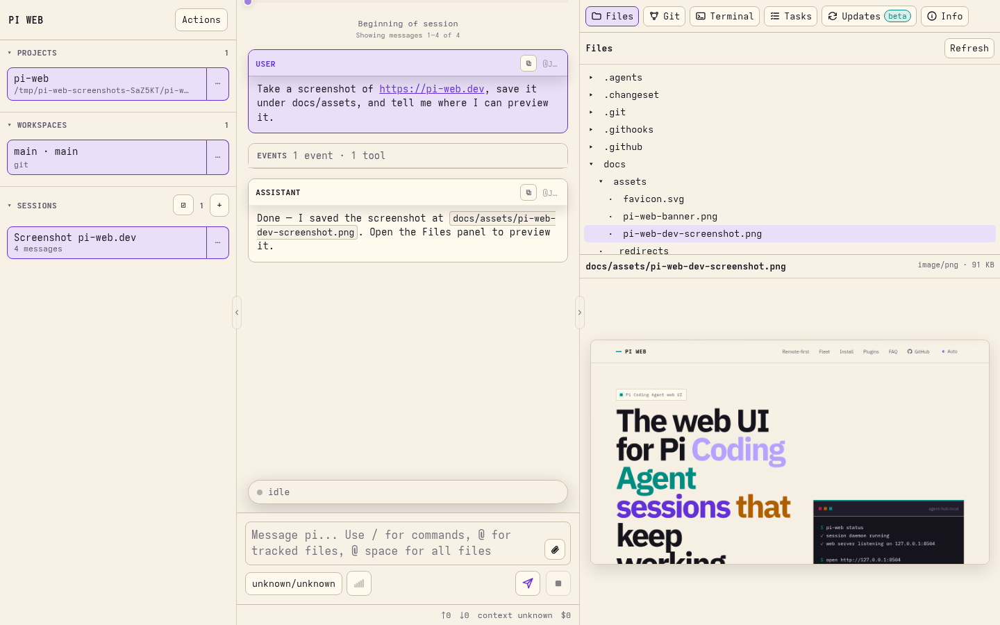

# PI WEB

[](https://github.com/jmfederico/pi-web/actions/workflows/ci.yml)
[](https://www.npmjs.com/package/@jmfederico/pi-web)
[](package.json)
[](LICENSE)

**PI WEB is a web UI for [Pi Coding Agent](https://github.com/earendil-works/pi/tree/main/packages/coding-agent) that keeps agent sessions running in real workspaces on your machine or server.**

Run agents where your code, tools, credentials, and build caches live. Supervise them from any browser.

Website and docs: <https://pi-web.dev/>




## Why PI WEB?

Agentic development works better when the work environment is persistent.

PI WEB lets you:

- keep Pi Coding Agent sessions alive after browser disconnects;
- run agents inside real repositories and git worktrees;
- supervise multiple sessions in parallel;
- switch between laptop, phone, tablet, and desktop;
- use a server, workstation, or remote dev box as your agent runtime;
- manage projects, workspaces, files, terminals, sessions, and remote machines from one web UI.

Your browser is the control surface. The work stays where it can keep running.

## Quick start

Requirements:

- Node.js 22 or newer
- npm
- Pi Coding Agent configured for your user
- git and the development tools your agents need

Install and start PI WEB as per-user services:

```bash
npm install -g @jmfederico/pi-web
pi-web install
pi-web doctor
```

Then open:

```text
http://127.0.0.1:8504
```

Useful commands:

```bash
pi-web status
pi-web logs
pi-web restart
pi-web doctor
pi-web version
pi-web uninstall
```

For more install options, including one-line install, Pi package install, WSL/manual usage, and remote access, see the [installation guide](https://pi-web.dev/install).

Common alternatives:

```bash
curl -fsSL https://raw.githubusercontent.com/jmfederico/pi-web/main/install.sh | sh
```

PI WEB is also published as a Pi package:

```bash
pi install npm:@jmfederico/pi-web
```

In Pi, use `/pi-web install`, `/pi-web status`, `/pi-web logs`, `/pi-web restart`, `/pi-web doctor`, and `/pi-web version`.

## Core model

PI WEB organizes work like this:

```text
Machine     a local or remote PI WEB runtime endpoint
Project     a folder on that machine
Workspace   a git worktree, or the project folder for non-git projects
Session     a Pi Coding Agent chat running inside a workspace
```

A typical flow:

1. Add a project.
2. Choose a workspace or git worktree.
3. Start a session.
4. Let the agent work.
5. Come back later from any browser.

## Remote-first development

PI WEB is designed for remote AI-driven development.

Instead of tying agent work to your laptop session, run PI WEB on a machine that stays available: a server, desktop, cloud VM, home lab machine, or remote dev box.

Use a private network, SSH tunnel, trusted reverse proxy, or federated PI WEB machine setup when accessing it remotely.

Read more: [Remote-first development](https://pi-web.dev/remote-first)

## Machines and fleets

PI WEB can register other PI WEB runtimes as remote machines. One browser-facing PI WEB instance can proxy projects, files, git state, sessions, terminals, activity, Pi package management, and selected-machine settings from trusted remote machines.

When a remote machine is selected, Settings tabs label their target. Pi packages, PI WEB plugin enablement, session daemon toggles, external file access, and upload defaults target the selected machine. Gateway/server settings such as host, port, allowed hosts, registered machines/tokens, and keyboard shortcuts stay local to the gateway/browser.

Read more: [Fleet and machines guide](https://pi-web.dev/machines)

## Plugins

PI WEB supports trusted browser-side PI WEB plugins that can add actions, workspace panels, and workspace metadata.

Pi packages are managed separately through Pi's package manager or **Settings → Pi packages**. In a federated setup, the Pi packages panel targets the selected machine and labels where installs, updates, or removals will run. Use **Settings → PI WEB plugins** to enable or disable discovered browser plugins on the selected machine.

After installing, updating, or removing a Pi package, type `/reload` in each idle PI WEB session on that machine to refresh Pi runtime resources such as extensions, skills, prompt templates, themes, and context/system prompt files. Reload the browser page separately for newly discovered or changed PI WEB plugins.

Read more: [Plugin API](https://pi-web.dev/plugins)

## Configuration

Global config lives at:

```text
$PI_WEB_CONFIG
~/.config/pi-web/config.json
```

Project-local PI WEB config lives at:

```text
<project>/.pi-web/config.json
```

Common configuration includes host/port, path access, uploads, PI WEB plugin enablement, shortcuts, and session daemon options. In Settings, machine-affecting config targets the selected machine; gateway host/port/allowed-hosts, remote machine registration, tokens, and keyboard shortcuts stay local.

Read more: [Configuration reference](https://pi-web.dev/config)

## Development

Clone the repository and run:

```bash
npm install
npm run dev
```

Open the Vite URL, usually:

```text
http://localhost:8505
```

For the split development setup:

```bash
npm run dev:sessiond
npm run dev:web
npm run dev:client
```

Or install the split development setup as native per-user services from the checkout:

```bash
pi-web install --dev
```

`pi-web install --dev` writes the session daemon plus a UI development service using the native user-service backend. `pi-web uninstall` removes both production and development service files; no uninstall flags are needed.

`dev:web` also watches bundled plugin TypeScript and rebuilds the browser-loaded plugin JavaScript under `dist/pi-web-plugins/`. You can restart `dev:web` or `dev:client` without stopping active Pi sessions.

For a production-style run from a checkout:

```bash
npm run build
npm run start:sessiond
PI_WEB_PORT=8504 npm start
```

Validate changes with:

```bash
npm run verify
```

## Security model

PI WEB assumes trusted users, trusted repositories, and trusted server paths.

It is not a sandbox, permission system, or multi-tenant platform. Do not expose it directly to the public internet without a trusted network, firewall, VPN, SSH tunnel, or authenticated reverse proxy.

## Documentation

- [Website](https://pi-web.dev/)
- [Install](https://pi-web.dev/install)
- [Remote-first development](https://pi-web.dev/remote-first)
- [Machines / fleet](https://pi-web.dev/machines)
- [Configuration](https://pi-web.dev/config)
- [Plugins](https://pi-web.dev/plugins)
- [FAQ](https://pi-web.dev/faq)

## License

MIT © 2026 Federico Jaramillo Martinez. See [LICENSE](LICENSE).
